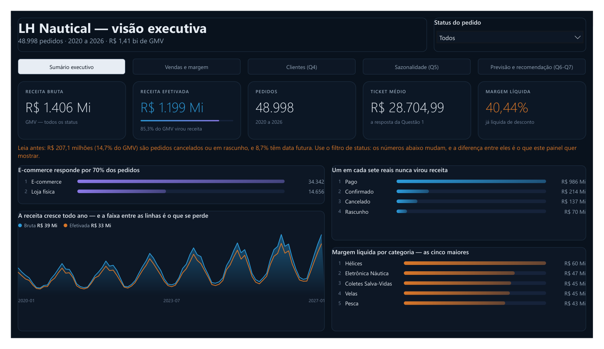
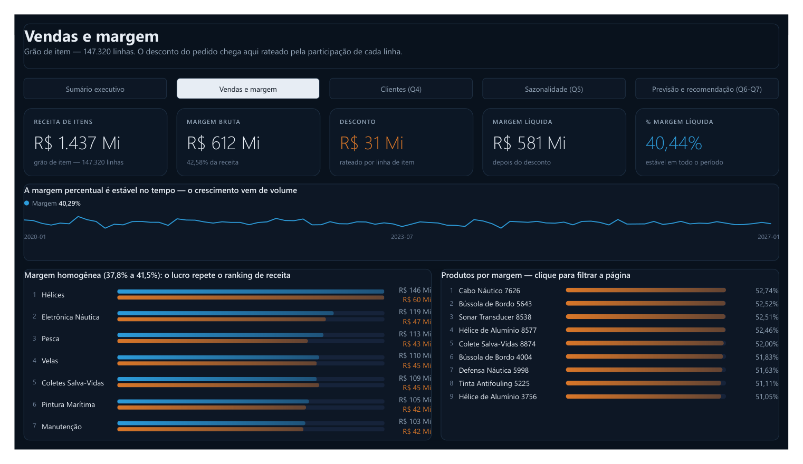
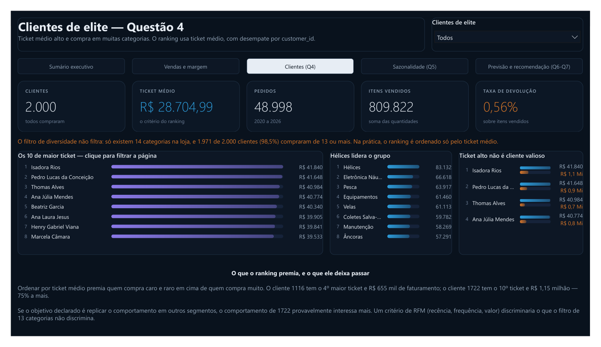
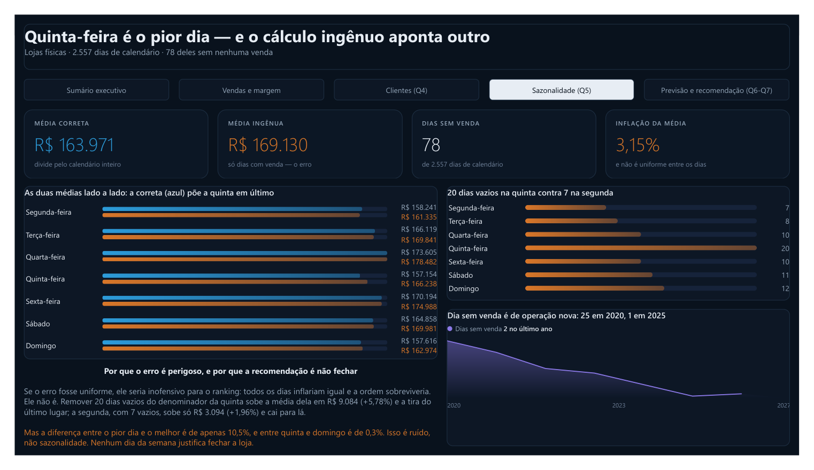
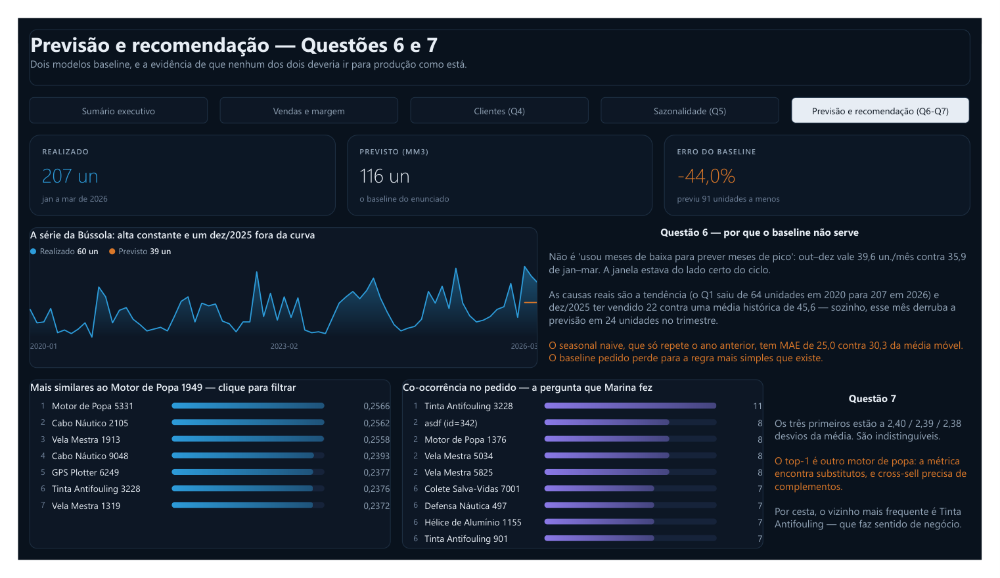

# Desafio Lighthouse 2026 — LH Nautical

Resposta ao Desafio Técnico do Programa Lighthouse 2026 da **Indicium**, trilha **Dados e IA**.

Pipeline completo de dados sobre o dump relacional de uma varejista náutica fictícia: da ingestão bruta de 24 CSVs à modelagem dimensional, análises SQL, modelo preditivo, sistema de recomendação e dashboard executivo.

**[▶ Abrir o dashboard publicado](https://app.powerbi.com/view?r=eyJrIjoiMDY4MDQxM2ItYWI4Ni00ZjQ5LWJmOGMtMTlhNDgwNDAzNjQzIiwidCI6ImMyMGU3MTg4LTNkMzEtNGM1ZC05YWNlLTE4MzQyM2E2MGMxZCJ9)**  ·  [PDF](powerbi/lh_nautical.pdf)  ·  por **[Breno Teodomiro](https://www.linkedin.com/in/breno-teodomiro-power-bi/)**

> *"Eu valorizo mais a organização e a explicação do que o código rodando sem eu entender nada."*
> — Gabriel Santos, Tech Lead (LH Nautical)
>
> Este repositório foi construído com essa frase como critério de projeto.

---

## O dashboard

Cinco páginas, **21 componentes em HTML gerado por DAX** — 13 deles filtram a
página inteira ao clique. Tema escuro, paleta validada para daltonismo, e cada
título é uma frase de conclusão, não um rótulo.

### Sumário executivo



### Vendas e margem



### Clientes — Questão 4



### Sazonalidade — Questão 5



### Previsão e recomendação — Questões 6 e 7



**Como ele é feito:** o projeto é versionado em **PBIP** — o modelo em TMDL e o
relatório em PBIR, ambos texto. Dá para ler o diff de uma medida no GitHub. Os
componentes visuais saem de [`powerbi/gerar_html_dax.py`](powerbi/gerar_html_dax.py),
e [`tests/validar_pbip.py`](tests/validar_pbip.py) roda 20 regras contra o
projeto antes de abrir o Desktop — cada uma testada injetando o defeito que ela
deve pegar.

---

## O problema

A LH Nautical opera lojas físicas, armazéns e e-commerce. Seus dados de 2020 a 2026 cobrem o ciclo completo — catálogo, pedidos, pagamentos, NF-e, compras, estoque e devoluções — em **24 CSVs, 433.424 linhas, 36 MB**, sem tratamento algum.

A missão: transformar isso em respostas que a diretoria consiga usar.

## Números da base

| | |
|---|---|
| Tabelas | 24 |
| Linhas | 433.424 |
| Período | 2020-01-01 a **2027-02-13** (o enunciado diz 2026) |
| Integridade referencial | **37/37 relacionamentos sem órfãos** |
| Consistência aritmética | fecha ao centavo em ~260 mil conferências |
| Classes de problema de qualidade catalogadas | **22** |

A base é estruturalmente sólida e semanticamente suja — a combinação exata que exige perfilamento antes de qualquer conclusão. O catálogo completo está em [`docs/QUALIDADE_DADOS.md`](docs/QUALIDADE_DADOS.md).

## Arquitetura

```
24 CSVs ──▶ [raw]  ──▶ [silver] ──▶ [gold] ──▶ Power BI
            bruto      limpo        star        dashboard
            sem        tipado       schema
            tratamento
               │
               └──▶ Q1, Q2, Q3, Q4, Q5   (as premissas exigem dado bruto)
```

Três schemas no mesmo PostgreSQL. As questões são respondidas contra `raw`, como o enunciado manda; o dashboard bebe de `gold`. A distância entre os dois **é** a resposta da questão 1.3.

## As 7 questões

| # | Frente | Entregável | Restrição crítica |
|---|---|---|---|
| 1 | EDA | [`q1_eda_orders.sql`](entregaveis/Q1_eda/) | só `orders`, sem limpeza, SQL |
| 2 | Schema | [`q2_gerar_schema.py`](entregaveis/Q2_schema/) | **somente stdlib** — pandas desclassifica |
| 3 | Carga | [`q3_carregar_csvs.py`](entregaveis/Q3_carga/) | sem tratamento de dados |
| 4 | Clientes | [`q4_clientes_elite.sql`](entregaveis/Q4_clientes/) | ≥13 de 14 categorias |
| 5 | Calendário | [`q5_dim_calendario.sql`](entregaveis/Q5_calendario/) | dias sem venda contam como zero |
| 6 | Previsão | [`q6_previsao_demanda.py`](entregaveis/Q6_previsao/) | média móvel 3m, sem vazamento |
| 7 | Recomendação | [`q7_recomendacao.py`](entregaveis/Q7_recomendacao/) | matriz binária, cosseno |

Rastreabilidade completa — premissa, entregável, resposta e gate de conformidade — em [`docs/MAPA_QUESTOES.md`](docs/MAPA_QUESTOES.md).

## Três achados que mudam respostas

**O filtro de elite da questão 4 não filtra.** Existem 14 categorias e o critério exige 13. Resultado: **1.971 dos 2.000 clientes (98,5%) passam** — 1.771 deles compraram de todas as 14. O ranking é decidido exclusivamente pelo ticket médio.

**O erro do estagiário na questão 5 troca o diagnóstico de dia.** Com o calendário completo, o pior dia é **quinta-feira** (R$ 157.154). Ignorando os 78 dias sem venda, a resposta vira segunda-feira. Seguindo o cálculo errado, a loja fecharia no dia errado.

**"Bússola de Bordo 702" existe duas vezes.** Dois `product_id` (74 e 240), marcas e categorias diferentes, descrição idêntica. A previsão da questão 6 vale 116, 76 ou 40 unidades conforme a leitura — e o baseline subestima a demanda real em 44% em qualquer cenário.

## Stack

**PostgreSQL** (exigido pelas questões 2 e 3) · **Python 3.12** com `uv` · pandas, numpy, scikit-learn, pyarrow · **Power BI** via PBIP/TMDL · ruff, mypy, pytest

Sem Docker, sem dbt, sem DuckDB — decisões justificadas nos [ADRs](docs/adr/); a de não usar dbt está detalhada na [ADR-008](docs/adr/ADR-008-sem-dbt.md).

## Como executar

Os CSVs não são versionados (material da Indicium). Coloque-os em `1-lh_nautical_csv/` na raiz.

```bash
sudo apt install -y postgresql postgresql-contrib   # uma vez
make setup      # dependências + verificação do ambiente
make db         # cria o banco e aplica o schema da Q2
make carga      # Q3 — carrega os 24 CSVs
make questoes   # roda as 7 questões e confere os números
make pipeline   # silver -> gold -> Parquet para o Power BI
make check      # ruff + mypy + pytest + gate de conformidade
```

`make check` inclui o **gate da questão 2**: um scan por AST que falha se o script importar qualquer coisa fora da biblioteca padrão.

## Documentação

| Documento | Conteúdo |
|---|---|
| [`docs/MAPA_QUESTOES.md`](docs/MAPA_QUESTOES.md) | controle central: premissa → entregável → resposta → gate |
| [`docs/PRD.md`](docs/PRD.md) | requisitos e critérios de aceite |
| [`docs/SPEC.md`](docs/SPEC.md) | especificação técnica por questão |
| [`docs/DICIONARIO_DADOS.md`](docs/DICIONARIO_DADOS.md) | 24 tabelas: grão, chaves, semântica |
| [`docs/QUALIDADE_DADOS.md`](docs/QUALIDADE_DADOS.md) | as 22 classes de sujeira, com evidência literal |
| [`docs/MODELO_DIMENSIONAL.md`](docs/MODELO_DIMENSIONAL.md) | star schema da camada gold |
| [`docs/DECISOES_ANALITICAS.md`](docs/DECISOES_ANALITICAS.md) | cada ambiguidade do enunciado e a leitura adotada |
| [`docs/adr/`](docs/adr/) | 8 decisões de arquitetura registradas |

---

**Autor:** Breno Teodomiro · Processo Seletivo Lighthouse 2026 — Indicium
